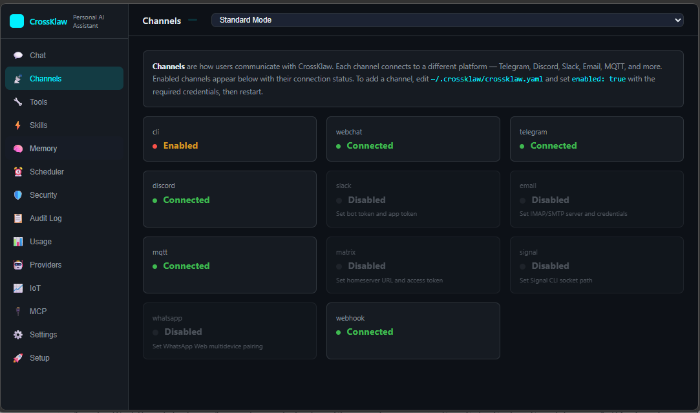
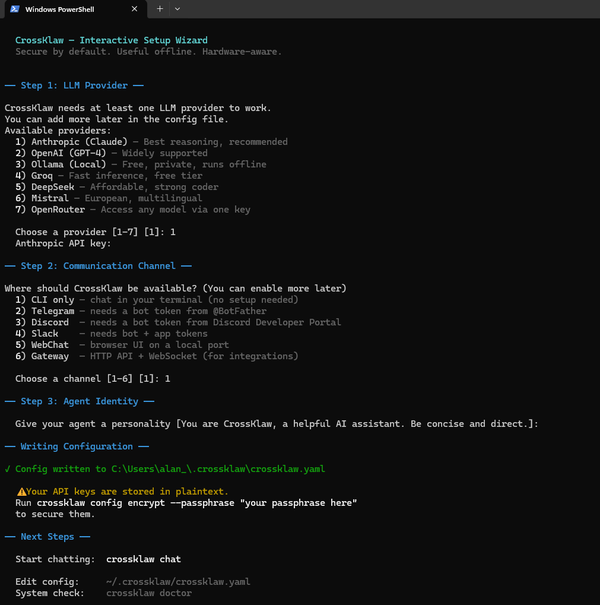
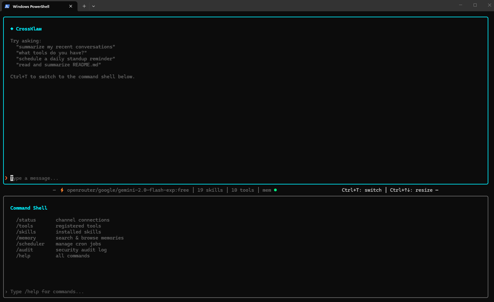
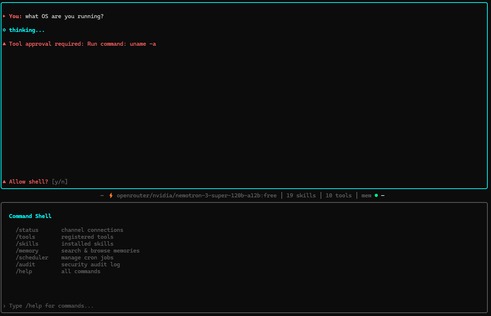

<p align="center">
  
</p>

<h1 align="center">CrossKlaw</h1>

<p align="center"><strong>One binary. Every channel. Your data.</strong></p>

<p align="center">
  <a href="https://youtu.be/M2aZd5-E32A"></a>
  <a href="https://github.com/cross-klaw/crossklaw/releases"></a>
</p>

An agentic AI platform that runs as a single Go binary. Secure by default, useful offline, hardware-aware.

CrossKlaw connects to 14 communication channels, orchestrates 11 LLM providers with intelligent routing and failover, controls IoT devices, and participates in multi-agent ecosystems via A2A and MCP — all from a ~46 MB self-contained binary with zero external dependencies. Runs on a Raspberry Pi.

<p align="center">
  
</p>

## Features

- **Single binary, zero dependencies** — pure Go with embedded SQLite, no CGO required, 46MB
- **14 channels** — Telegram, Discord, Slack, WhatsApp, Signal, Matrix, Email, WebChat, MQTT, Webhook, CLI, TUI, Dashboard, Microsoft Teams
- **11 LLM providers** — Anthropic, OpenAI, Gemini, DeepSeek, Groq, OpenRouter, Ollama, Mistral, Azure OpenAI, Cerebras, Together AI
- **Intelligent model routing** — routes simple queries to fast/cheap models, complex reasoning to powerful ones, with automatic failover
- **A2A protocol server** — Google Agent-to-Agent v1.0; CrossKlaw is discoverable by and accepts tasks from other AI agents
- **MCP client and server** — use external MCP tools AND expose CrossKlaw as tools for Claude Desktop, Cursor, etc.
- **WASM skill sandboxing** — execute untrusted skills in a WebAssembly sandbox (wazero, zero CGO) with memory limits, timeouts, and no filesystem/network access
- **Multi-agent delegation** — spawn sub-agents with per-role tool restrictions, injection detection on worker I/O, and full audit trail
- **Voice input** — Whisper transcription on dashboard, webchat, Telegram, Discord, Slack, and WhatsApp; microphone button in web UIs
- **Prompt injection defence** — 20+ weighted patterns, base64 scanning, structural analysis; applied on every channel including A2A
- **Config encryption** — AES-256-GCM with Argon2id key derivation; `crossklaw config encrypt` to protect API keys at rest
- **Audit logging** — every tool call, injection attempt, A2A task, and permission decision is logged
- **Skill system** — Markdown-based skills with Ed25519 signature verification + WASM sandbox for executable skills
- **IoT bridge** — MQTT, Home Assistant, GPIO pin control, time-series storage, EWMA anomaly detection, alerts
- **Document RAG** — chunked indexing of .txt, .md, .csv, .json, .yaml with vector similarity search
- **Persistent memory** — SQLite with vector search; episodic, semantic, and procedural memory across conversations
- **19 bundled skills, 10 sector templates** — healthcare, manufacturing, agriculture, energy, DevOps, and more
- **Scheduled tasks** — cron-style job scheduler with SQLite persistence and heartbeat
- **Interactive setup** — `crossklaw setup` gets you running in 2 minutes
- **Diagnostics** — `crossklaw doctor` runs comprehensive self-checks
- **Cross-platform** — Linux (amd64/arm64), macOS (amd64/arm64), Windows (amd64)

## Quick Start

<p align="center">
  
</p>

### Download and Run

```bash
# Download the binary for your platform from GitHub Releases
# Then run the setup wizard:
./crossklaw setup

# Start chatting:
./crossklaw chat

# Or start the full gateway (all channels + dashboard + A2A + MCP):
./crossklaw run
```

### From Source

```bash
# Clone and build
git clone https://github.com/cross-klaw/crossklaw.git
cd crossklaw
make build

# Run setup wizard
./bin/crossklaw setup

# Start chatting
./bin/crossklaw chat
```

### With Docker

```bash
# Copy and edit config
cp crossklaw.example.yaml crossklaw.yaml

# Start (gateway + webchat)
ANTHROPIC_API_KEY=sk-ant-... docker compose up -d

# With MQTT broker for IoT
ANTHROPIC_API_KEY=sk-ant-... docker compose --profile iot up -d
```

### Pre-built Binaries

```bash
make build-all
# Outputs:
#   bin/crossklaw-linux-amd64
#   bin/crossklaw-linux-arm64
#   bin/crossklaw-darwin-arm64
#   bin/crossklaw-windows-amd64.exe
```

## Architecture

```
                    Channels
          +---------------------------+
          | Telegram | Discord | CLI  |
          | WebChat  | MQTT           |
          +----------+----------------+
                     |
              +------v------+
              |   Gateway    |  HTTP/WebSocket API (:18800)
              |   Router     |  WebChat UI          (:18801)
              +------+-------+
                     |
              +------v-------+
              |    Agent      |  Agentic loop (multi-turn tool use)
              |   Runtime     |  Prompt injection scan on every input
              +--+----+---+--+
                 |    |   |
        +--------+ +--+  +--------+
        |          |               |
   +----v---+ +---v----+   +------v----+
   | Tools  | | Memory |   |   Skills  |
   | Shell  | | SQLite |   | Markdown  |
   | Files  | | Vector |   | Signed    |
   | HTTP   | | Search |   | Triggered |
   +--------+ +--------+   +-----------+
        |
   +----v--------+
   |  IoT Bridge  |
   | MQTT | HA    |
   | GPIO         |
   +-------------+
```

## CLI Commands

<p align="center">
  
</p>

| Command | Description |
|---|---|
| `crossklaw setup` | Interactive setup wizard — get running in 2 minutes |
| `crossklaw chat` | Interactive terminal chat session (TUI with status bar) |
| `crossklaw run` | Start gateway server with all enabled channels, A2A, and MCP |
| `crossklaw send "message"` | One-shot query, prints response and exits |
| `crossklaw doctor` | Run comprehensive diagnostic checks |
| `crossklaw config init` | Create default config at `~/.crossklaw/crossklaw.yaml` |
| `crossklaw config validate` | Validate the current config file |
| `crossklaw config encrypt` | Encrypt API keys in config with AES-256-GCM |
| `crossklaw version` | Print version, commit hash, and build date |
| `crossklaw skills list` | List installed skills with signature status |
| `crossklaw keys generate` | Generate Ed25519 keypair for skill signing |
| `crossklaw memory search "query"` | Search persistent memory |

## Configuration

Config file location: `~/.crossklaw/crossklaw.yaml`

All settings can be overridden with environment variables using the `CROSSKLAW_` prefix:

| Environment Variable | Config Path | Default |
|---|---|---|
| `ANTHROPIC_API_KEY` | `providers.anthropic.api_key` | _(required)_ |
| `CROSSKLAW_GATEWAY_HOST` | `gateway.host` | `127.0.0.1` |
| `CROSSKLAW_GATEWAY_PORT` | `gateway.port` | `18800` |
| `CROSSKLAW_AGENT_MODEL_PRIMARY` | `agent.model.primary` | `claude-sonnet-4-20250514` |
| `CROSSKLAW_PROVIDERS_OLLAMA_BASE_URL` | `providers.ollama.base_url` | `http://localhost:11434` |

### Minimal Config

```yaml
providers:
  anthropic:
    api_key: "sk-ant-..."

channels:
  webchat:
    enabled: true
```

### Full Config Reference

```yaml
gateway:
  host: "127.0.0.1"
  port: 18800

agent:
  name: "CrossKlaw"
  identity: "You are CrossKlaw, a helpful personal AI assistant."
  model:
    primary: "claude-sonnet-4-20250514"
    fallback: "claude-haiku-4-20250514"
  max_turns: 25
  max_tokens: 8192
  temperature: 0.7

providers:
  anthropic:
    api_key: ""
  openai:
    api_key: ""
  ollama:
    base_url: "http://localhost:11434"

channels:
  cli:
    enabled: true
  telegram:
    enabled: false
    token: ""
    allowed_users: []
  discord:
    enabled: false
    token: ""
    allowed_guilds: []
  webchat:
    enabled: true
    port: 18801
  mqtt:
    enabled: false
    broker: "tcp://localhost:1883"
    topic_prefix: "crossklaw"

memory:
  enabled: true
  db_path: ""              # defaults to ~/.crossklaw/memory.db
  summary_interval: 10     # summarise every N messages
  similarity_k: 5          # top-K results for memory recall
  threshold: 0.3           # minimum similarity score

security:
  encrypt_config: false
  audit_log: true
  injection_detection: true
  skill_verification: false  # set true to require Ed25519 signatures

skills:
  enabled: true
  skill_dir: ""            # defaults to ~/.crossklaw/skills

iot:
  enabled: false
  mqtt:
    broker: "tcp://localhost:1883"
    username: ""
    password: ""
    topic_prefix: "home"
  homeassistant:
    url: ""
    token: ""
  gpio:
    chip: ""
    pins: []

scheduler:
  max_jobs: 20
  heartbeat:
    enabled: false
    interval: "30m"
    prompt: "Quick status check — anything I should know about?"
```

## API

### Health Check

```
GET /api/v1/health
```

```json
{"status": "ok"}
```

### Chat (HTTP)

```
POST /api/v1/chat
Content-Type: application/json

{
  "session_id": "abc-123",
  "content": "What's the weather like?",
  "from": "user"
}
```

```json
{
  "id": "msg-uuid",
  "session_id": "abc-123",
  "content": "I don't have a weather tool, but I can ...",
  "timestamp": "2025-06-15T10:30:00Z"
}
```

### WebSocket

```
GET /ws
```

Send and receive `protocol.Message` JSON objects over the WebSocket connection. Each message includes `id`, `session_id`, `channel`, `from`, `content`, and `timestamp` fields.

## Built-in Tools

| Tool | Description | Policy |
|---|---|---|
| `shell` | Execute shell commands | Dangerous patterns blocked (`rm -rf /`, fork bombs, `dd` to devices) |
| `read_file` | Read file contents | Allowed |
| `write_file` | Write/create files | Requires approval |
| `list_directory` | List directory contents | Allowed |
| `http_get` | HTTP GET request | Allowed |
| `http_post` | HTTP POST request | Requires approval |

IoT tools (when enabled):

| Tool | Description |
|---|---|
| `iot_list_devices` | List all registered IoT devices |
| `iot_control_device` | Send command to a device (on/off/set) |
| `iot_device_status` | Get current state of a device |

## Skills

Skills are Markdown files with YAML frontmatter that teach the agent new capabilities.

### Skill Format (`SKILL.md`)

```markdown
---
name: my-skill
description: What this skill does
version: 1.0.0
author: Your Name
tools:
  - shell
  - read_file
permissions:
  - filesystem:read:*
triggers:
  - "keyword one"
  - "keyword two"
signature: ""  # Ed25519 signature (optional unless skill_verification is enabled)
---

# Skill Instructions

Step-by-step instructions for the agent in Markdown.
The agent receives this as context when the skill is triggered.
```

### Bundled Skills

| Skill | Triggers | Description |
|---|---|---|
| `web-search` | search, look up, google, current news | Search via DuckDuckGo / Brave APIs |
| `file-manager` | create/edit/find/list/rename files | File system operations |
| `system-monitor` | system info, CPU, memory, disk, uptime | System status reporting |

### Installing Custom Skills

Drop a folder with a `SKILL.md` into `~/.crossklaw/skills/`:

```
~/.crossklaw/skills/
  my-custom-skill/
    SKILL.md
```

### Signing Skills

```bash
# Generate a keypair
crossklaw keys generate

# Sign a skill (adds signature to frontmatter)
# The verifier checks Ed25519 signatures against keys in ~/.crossklaw/keys/
```

## Security

<p align="center">
  
</p>

CrossKlaw is pen tested against 22 automated security checks across 9 attack categories: prompt injection (including base64 and A2A vectors), request size attacks, authentication bypass, path traversal, information disclosure, method fuzzing, rate limiting, webhook injection, and MCP server abuse. Run the tests yourself: `bash tests/pentest.sh`

### Prompt Injection Detection

Every user message is scanned before processing. The detector uses 20+ weighted regex patterns covering:

- Direct instruction overrides ("ignore previous instructions")
- Role hijacking ("you are now DAN")
- System message spoofing ("[system]: ...")
- Base64-encoded payloads (decoded and re-scanned)
- Structural analysis (text that looks like a system prompt)
- Hidden instructions in HTML/Markdown comments

Messages scoring above the threshold (default 0.8) are blocked and audit-logged.

### Config Encryption

Sensitive config values (API keys, tokens) can be encrypted at rest:

```yaml
security:
  encrypt_config: true

providers:
  anthropic:
    api_key: "ENC:base64-aes-256-gcm-ciphertext..."
```

Uses AES-256-GCM with keys derived via Argon2id (64 MB memory, 4 threads).

### Tool Policy

Every tool call goes through a three-tier permission system:

- **Allow** — executed immediately (read operations)
- **Ask** — requires user approval before execution
- **Deny** — blocked outright (dangerous shell patterns like `rm -rf /`, fork bombs)

### Audit Log

All events are logged with timestamps: tool executions, injection detections, permission decisions, and errors.

### Authentication

When `auth.enabled: true`, the gateway requires API key authentication for all HTTP and WebSocket requests. Keys are managed via the CLI:

```bash
crossklaw auth create --name "my-app"    # Generate a new API key
crossklaw auth list                       # List all active keys
crossklaw auth revoke <key-id>            # Revoke a key
```

Clients pass the key via the `Authorization: Bearer <key>` header. When auth is disabled (default), the gateway runs in self-hosted mode with no authentication — suitable for local use or when behind a reverse proxy.

## Dashboard

When `dashboard.enabled: true` (the default), CrossKlaw serves an embedded web monitoring dashboard at `/dashboard` on the gateway port (default: http://localhost:18800/dashboard). The dashboard provides real-time visibility into:

- Active channels and their connection status
- Recent conversations and tool executions
- Memory and document index statistics
- IoT device status (when enabled)

A demo mode is available for testing the dashboard without a live LLM connection.

## MCP Servers

CrossKlaw supports [Model Context Protocol](https://modelcontextprotocol.io/) (MCP) external tool servers. MCP allows the agent to use tools provided by external processes — file systems, databases, APIs, and more.

Configure MCP servers in `crossklaw.yaml`:

```yaml
mcp:
  servers:
    - name: github
      command: npx
      args: ["-y", "@modelcontextprotocol/server-github"]
      env:
        GITHUB_PERSONAL_ACCESS_TOKEN: "ghp_..."
      enabled: true
```

MCP tools are automatically discovered at startup and made available to the agent alongside built-in tools. Each MCP server runs as a subprocess managed by CrossKlaw.

## Memory System

CrossKlaw maintains persistent memory across conversations:

| Type | Purpose |
|---|---|
| **Episodic** | Conversation history and summaries |
| **Semantic** | Facts and knowledge extracted from conversations |
| **Procedural** | Learned patterns and preferences |

Memory is stored in SQLite (`~/.crossklaw/memory.db`) with vector similarity search for contextual recall. The current embedder uses a hash-based bag-of-words approach (256 dimensions, fully offline, no external models required).

## IoT Bridge

When `iot.enabled: true`, CrossKlaw can control smart home devices through three backends:

- **MQTT** — subscribe/publish to any MQTT broker for custom IoT devices
- **Home Assistant** — auto-discovers entities and sends `turn_on`/`turn_off`/`toggle` commands via the HA REST API
- **GPIO** — direct pin control for Raspberry Pi and similar SBCs

Devices are tracked in a SQLite registry and exposed to the agent as tools.

## Recommended Local Models (Ollama)

When running CrossKlaw offline with Ollama, choosing the right model for your hardware makes a significant difference. The table below lists tested configurations that balance capability against resource requirements.

| Hardware Tier | Recommended Model | Parameters | What It Handles Well |
|---|---|---|---|
| Raspberry Pi 5 / Edge device | **Qwen3-4B** | 4B | Single-tool calls, sensor reads, simple queries, basic IoT commands |
| Desktop / Mini PC / NUC | **Qwen3-8B** | 8B | Full agentic workflows, memory recall, scheduling, multi-turn conversations |
| Workstation / Server | **Qwen3-30B-A3B** (MoE) | 30B (3B active) | Complex reasoning, compliance analysis, multi-step tool chains, DevOps workflows |
| NVIDIA DGX Spark / GPU server | **Qwen3-32B** (dense) | 32B | Maximum capability, all features at full quality |

### Notes

- **Qwen3-30B-A3B** is a Mixture-of-Experts model that only activates 3B parameters per inference step, so it runs significantly faster and lighter than its 30B parameter count suggests. This makes it an excellent choice for mid-range hardware where reasoning depth matters (compliance, DevOps, field service).
- **Qwen3-4B** is capable for straightforward single-tool interactions but will struggle with complex multi-step agentic chains. Set `agent.max_turns` lower (e.g. 5) on edge devices to avoid long inference loops.
- All models above support tool use / function calling, which CrossKlaw requires for its agentic loop. If substituting a different model family, verify that it supports structured tool-call output via Ollama.
- CrossKlaw is model-agnostic. Any Ollama-compatible model works. The recommendations above are based on testing across the ten sector templates and represent the best balance of quality, speed, and resource usage for each tier.

### Quick Setup

```bash
# Install Ollama (Linux)
curl -fsSL https://ollama.com/install.sh | sh

# Pull your chosen model
ollama pull qwen3:8b

# Configure CrossKlaw to use it
# In crossklaw.yaml:
providers:
  ollama:
    base_url: "http://localhost:11434"
agent:
  model:
    primary: "qwen3:8b"
```

## Voice Input

CrossKlaw supports voice input on the dashboard and Telegram channels via the OpenAI-compatible Whisper transcription API. When enabled, a microphone button appears next to the chat input on the dashboard. Click to record, click again to stop -- the audio is transcribed and sent as a chat message automatically.

### Cloud Setup (Groq -- Fastest)

```yaml
voice:
  enabled: true
  # Uses your Groq API key by default (fastest Whisper endpoint available)
  # api_key: ""        # falls back to providers.groq.api_key
  # model: "whisper-large-v3-turbo"

providers:
  groq:
    api_key: "gsk_..."
```

### Local Setup (whisper.cpp -- Fully Offline)

For air-gapped deployments, run a local whisper.cpp server and point CrossKlaw at it:

```bash
# Build and run whisper.cpp server (see https://github.com/ggml-org/whisper.cpp)
./whisper-server -m models/ggml-base.en.bin --port 8080

# Or use Docker
docker run -p 8080:8080 ghcr.io/ggml-org/whisper.cpp:main-server -m /models/ggml-base.en.bin
```

```yaml
voice:
  enabled: true
  api_key: "local"                         # any non-empty value
  base_url: "http://localhost:8080/v1"     # local whisper.cpp server
  model: "whisper-1"                       # model name (ignored by most local servers)
```

Both approaches use the same OpenAI-compatible `/audio/transcriptions` endpoint, so any compatible server works.

## Docker

### Build and Run

```bash
docker build -t crossklaw .
docker run -d \
  -p 18800:18800 \
  -p 18801:18801 \
  -e ANTHROPIC_API_KEY=sk-ant-... \
  -e CROSSKLAW_GATEWAY_HOST=0.0.0.0 \
  -v crossklaw-data:/home/crossklaw/.crossklaw \
  crossklaw
```

### Docker Compose

```bash
# Gateway + WebChat
docker compose up -d

# With MQTT broker
docker compose --profile iot up -d
```

The container runs as a non-root user (`crossklaw`, UID 1000) on Alpine 3.20.

## Development

### Prerequisites

- Go 1.24+
- GNU Make (optional, for `make` targets)

### Build

```bash
make build          # → bin/crossklaw
make build-all      # Cross-compile for linux/darwin/windows
make test           # go test -v -race ./...
make lint           # golangci-lint (optional)
make install        # go install to $GOPATH/bin
```

### Project Structure

```
cmd/crossklaw/          CLI entrypoint (Cobra commands)
internal/
  agent/                 Agentic loop, session management
  channels/              Channel interface + implementations
    cli/                   Interactive terminal
    telegram/              Telegram Bot API
    discord/               Discord bot (discordgo)
    webchat/               Embedded web UI + WebSocket
    mqtt/                  MQTT pub/sub channel
  config/                YAML config loading, validation, env overrides
  doctor/                Diagnostic self-checks
  gateway/               HTTP + WebSocket API server
  inference/             LLM provider interface + Anthropic adapter
  iot/                   IoT bridge (MQTT, Home Assistant, GPIO)
  memory/                SQLite store, embeddings, vector search
  scheduler/             Cron job engine + heartbeat
  security/              Injection detection, sanitisation, crypto, audit
  skills/                Skill parser, manager, Ed25519 verifier
  tools/                 Tool interface, registry, executor, policy
    builtin/               Shell, filesystem, HTTP tools
pkg/
  protocol/              Shared message types
  version/               Build version info
skills/
  bundled/               Embedded default skills (web-search, file-manager, system-monitor)
```

### Running Tests

```bash
# All tests
go test ./...

# Specific package
go test ./internal/security/...

# With race detector and verbose output
go test -v -race ./internal/memory/...
```

Current test coverage spans security (injection, sanitisation, crypto), memory (embeddings, vector search), scheduler (cron parser, persistence), skills (parser), tools (registry, executor, policy), and config (validation).

## Ports

| Port | Service | Default Bind |
|---|---|---|
| `18800` | Gateway API + WebSocket | `127.0.0.1` |
| `18801` | WebChat UI | `0.0.0.0` |
| `1883` | MQTT broker (Docker Compose, optional) | `0.0.0.0` |

## License

CrossKlaw is free for personal, educational, and evaluation use. Commercial use requires a license from Black Stick Ltd. See [LICENSE](LICENSE) for details.

Contact: crossklaw@blackstick.co.uk
